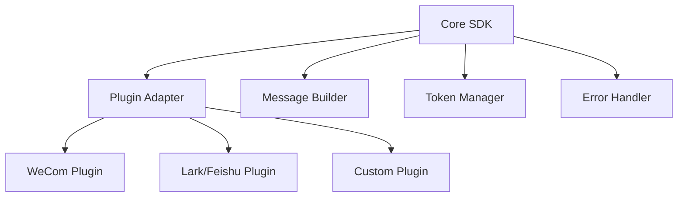

<!--
 * @Author: @memo28.repo
 * @Date: 2025-07-28 17:57:19
 * @LastEditTime: 2025-08-10 19:50:00
 * @Description: Notification SDK - 企业级消息通知解决方案
 * @FilePath: /memo28.pro.Repo/packages/notification/README.md
-->

# @memo28.pro/notification

[](https://badge.fury.io/js/@memo28.pro%2Fnotification)
[](https://opensource.org/licenses/ISC)
[](https://www.typescriptlang.org/)

🚀 **企业级消息通知解决方案** - 支持多平台消息推送的轻量级 TypeScript SDK

## ✨ 特性

- 🎯 **多平台支持**: 企业微信、飞书、钉钉等主流平台
- 🔧 **插件化架构**: 易于扩展和自定义
- 📝 **消息构建器**: 支持文本、Markdown 等多种格式
- 🛡️ **类型安全**: 完整的 TypeScript 类型定义
- ⚡ **轻量高效**: 零依赖，体积小巧
- 🧪 **完整测试**: 单元测试和集成测试覆盖

## 📦 安装

```bash
# npm
npm install @memo28.pro/notification

# yarn
yarn add @memo28.pro/notification

# pnpm
pnpm add @memo28.pro/notification
```

## 🚀 快速开始

### 基础用法

```typescript
import { Core, MessageBuilder, Wxcom } from '@memo28.pro/notification';

// 创建核心实例
const core = new Core();

// 创建消息构建器
const msgBuilder = MessageBuilder.create()
  .setText('🚀 Hello World!')
  .setMarkdown('# 标题\n\n**粗体文本**');

// 创建企业微信插件
const wxcomPlugin = new Wxcom('YOUR_WEBHOOK_URL');

// 注册插件并发送消息
core.registerModule(wxcomPlugin);
core.seed(msgBuilder);

// 发送消息
const result = await wxcomPlugin.send();
console.log('发送结果:', result);
```

### 高级用法

```typescript
import { Core, MessageBuilder, Wxcom } from '@memo28.pro/notification';

// 创建多个插件实例（发送到不同群组）
const wxcomPlugin1 = new Wxcom('WEBHOOK_URL_1');
const wxcomPlugin2 = new Wxcom('WEBHOOK_URL_2');

// 构建复杂消息
const msgBuilder = MessageBuilder.create()
  .setText('📢 系统通知')
  .setMarkdown(`
# 📊 系统状态报告

## 服务状态
- **API服务**: ✅ 正常
- **数据库**: ✅ 正常
- **缓存**: ⚠️ 警告

## 统计信息
- 在线用户: **1,234**
- 今日访问: **12,345**

---
*报告时间: ${new Date().toLocaleString()}*
  `)
  .setText('📝 如有问题请及时处理');

// 注册多个插件
const core = new Core();
core.registerModule([wxcomPlugin1, wxcomPlugin2]);
core.seed(msgBuilder);

// 批量发送
const results = await Promise.all([
  wxcomPlugin1.send(),
  wxcomPlugin2.send()
]);

console.log('发送结果:', results);
```

## 📚 API 文档

### Core 类

核心管理类，负责插件注册和消息分发。

```typescript
class Core {
  // 注册单个或多个插件
  registerModule(module: Base | Base[]): void;
  
  // 播种消息到所有已注册的插件
  seed(msgBuilder: MessageBuilder): void;
  
  // 获取已注册插件数量
  getModuleCount(): number;
}
```

### MessageBuilder 类

消息构建器，支持链式调用构建多种格式的消息。

```typescript
class MessageBuilder {
  // 创建新的消息构建器实例
  static create(): MessageBuilder;
  
  // 添加文本消息
  setText(text: string): MessageBuilder;
  
  // 添加 Markdown 消息
  setMarkdown(markdown: string): MessageBuilder;
  
  // 获取消息数量
  getMessageCount(): number;
  
  // 获取所有消息
  getMessages(): MessageBuilderPayload[];
  
  // 清空所有消息
  clear(): MessageBuilder;
}
```

### Wxcom 类

企业微信插件，实现企业微信 Webhook 消息发送。

```typescript
class Wxcom extends Base {
  // 构造函数
  constructor(webhook?: string);
  
  // 设置 Webhook 地址
  setWebhook(webhook: string): void;
  
  // 发送消息
  send(): Promise<boolean>;
  
  // 获取插件名称
  getName(): string;
}
```

## 🔌 插件开发

你可以通过继承 `Base` 类来开发自定义插件：

```typescript
import { Base, MessageBuilderPayload } from '@memo28.pro/notification';

class CustomPlugin extends Base {
  constructor(private config: any) {
    super();
  }
  
  getName(): string {
    return 'custom';
  }
  
  async send(): Promise<boolean> {
    try {
      // 获取消息列表
      const messages = this.getMessages();
      
      // 实现你的发送逻辑
      for (const message of messages) {
        await this.sendMessage(message);
      }
      
      return true;
    } catch (error) {
      console.error('发送失败:', error);
      return false;
    }
  }
  
  private async sendMessage(message: MessageBuilderPayload): Promise<void> {
    // 根据消息类型实现具体发送逻辑
    switch (message.type) {
      case 'text':
        // 发送文本消息
        break;
      case 'markdown':
        // 发送 Markdown 消息
        break;
    }
  }
}
```

## 🧪 测试

```bash
# 运行所有测试
npm test

# 运行测试并监听文件变化
npm run test:watch

# 运行测试 UI
npm run test:ui
```

## 📋 系统架构



## 🤝 贡献

欢迎提交 Issue 和 Pull Request！

1. Fork 本仓库
2. 创建你的特性分支 (`git checkout -b feature/AmazingFeature`)
3. 提交你的修改 (`git commit -m 'Add some AmazingFeature'`)
4. 推送到分支 (`git push origin feature/AmazingFeature`)
5. 打开一个 Pull Request

## 📄 许可证

本项目采用 [ISC](https://opensource.org/licenses/ISC) 许可证。

## 🔗 相关链接

- [企业微信机器人文档](https://developer.work.weixin.qq.com/document/path/91770)
- [飞书机器人文档](https://open.feishu.cn/document/ukTMukTMukTM/ucTM5YjL3ETO24yNxkjN)
- [钉钉机器人文档](https://developers.dingtalk.com/document/app/custom-robot-access)

---

<p align="center">
  Made with ❤️ by <a href="https://github.com/memo28">@memo28.repo</a>
</p>
